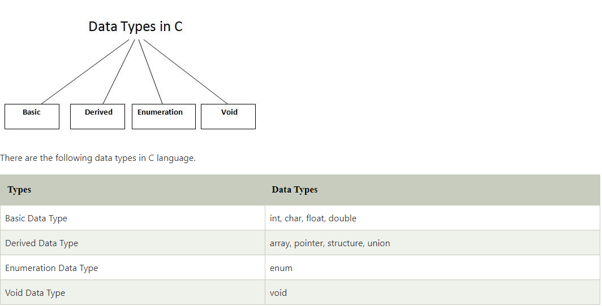
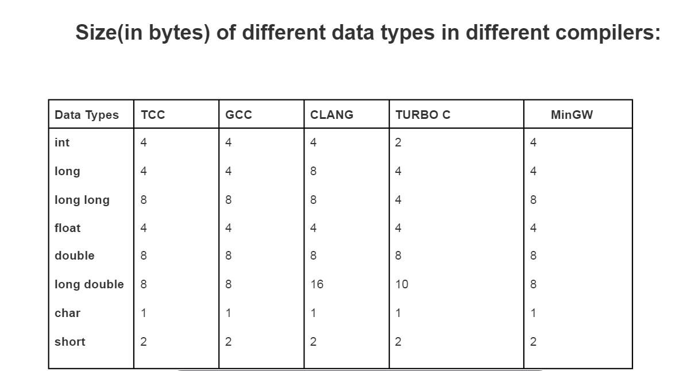
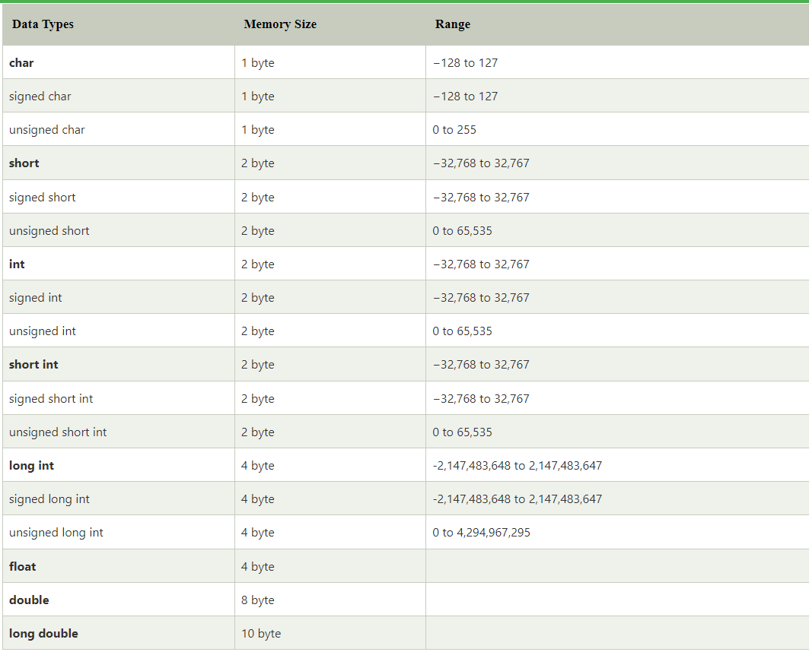
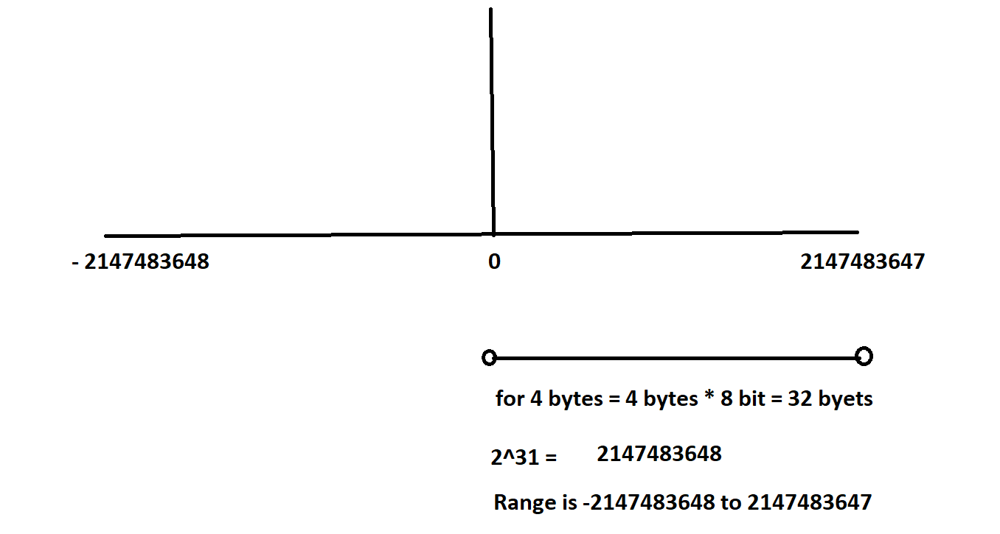

# C Programming 

### C is High Level Programming Language.

#### 1. What is the Programming?
Programming is logical thinking of persion for achieve some task or for automization purpose.

#### 2. So what is Coding?
Coding is implementation of logical thinking(Programming) in Computer Languague.

# DataTypes in C:
Datatypes means to decide which type of information we want to use in our program called data type./ type of data a variable can hold.

# Datatype: 
1. Built in Datatypes: 
Built-in Data types are those data types that are pre-defined by the programming language.

2. Derived Datatypes: 
Those data type complete its meaning with another datatype called as Derived Datatypes.

3. User Defined Datatypes: 
those datatypes are defined by user for its own purpose called user defined datatypes.

# Memory: 
bit and byte is unit of memory measure.
1. 1 bit = block of memory
2. 4 bit = nible
3. 8 bit = 1 byte
4. 16 bit = 1 word
5. 1024 byte = 1Kb

##### Note : Therefore 1KB must equal 1024 Bytes, 1MB must equal 1048576 Bytes (1024x1024) etc.

# Datatype Range

# Calculating Range of Varible
if int = 4 byte
1 byte = 8 bit 
4 byte = 32 bit

2^(32-1) = 2147483648;

# Sizeof()
it helps to measure size of variable.

# Limit Header file
this hedear file include methods that help us to find range of datatypes
