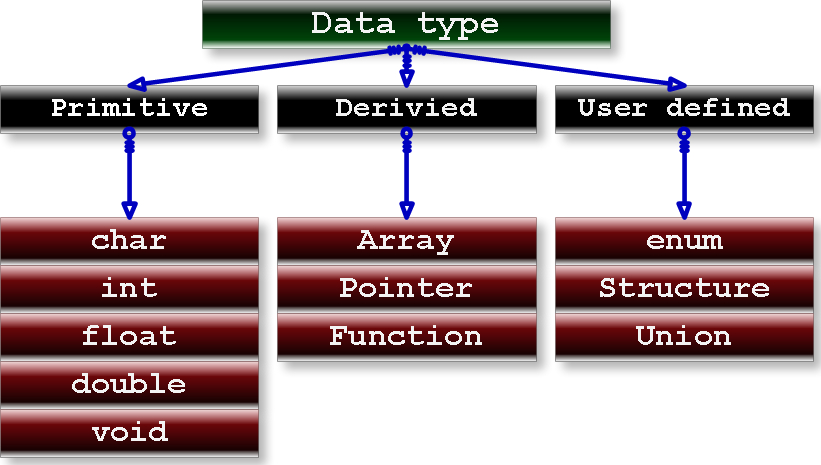

# C Programming 

### C is High Level Programming Language.

#### 1. What is the Programming?
Programming is logical thinking of persion for achieve some task or for automization purpose.

#### 2. So what is Coding?
Coding is implementation of logical thinking(Programming) in Computer Languague.

# DataTypes in C:
Datatypes means to decide which type of information we want to use in our program called data type./ type of data a variable can hold.

